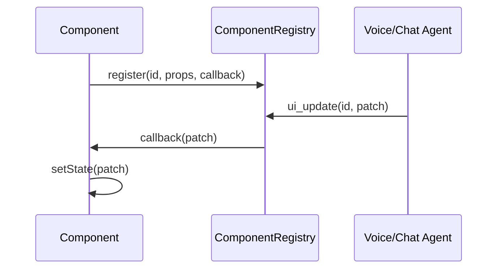

# 🖼️ custom Component System – 2025

This document is the single source of truth for how UI components are rendered, updated and synchronised across users and agents.

*Replaces `ARCHITECTURE_SIMPLIFIED.md` and the component parts of `ARCHITECTURE_SYNC_BUS.md`.*

---

## 1. Core Concepts

| Concept | File | Summary |
|---------|------|---------|
| **ComponentRegistry** | `src/lib/component-registry.ts` | Global map of every live component on the canvas – ID, props, diff history, update callback |
| **ui_update** tool | `src/lib/custom.ts` | AI‐facing function for patching any component’s props |
| **list_components** tool | `src/lib/custom.ts` | Enumerate current IDs/types so AI can target updates |
| **useComponentRegistration** | `src/lib/component-registry.ts` | Hook run by each component to self-register |
| **PropertyDiffViewer** | `src/components/ui/property-diff-viewer.tsx` | Generic UI for showing prop changes |
| **Integration Guide** | `docs/component-steward-guide.md` | Checklist for steward + widget contracts, perf, and testing |

---

## 2. Lifecycle



1. **Register** – on mount, component calls the hook which stores a `ComponentInfo` entry. Initial `originalProps` are captured.
2. **Update** – any party (AI, collaborative tool, local user) can call `ui_update` which forwards to `ComponentRegistry.update`.
3. **Diff log** – `update()` merges props, computes shallow `PropertyDiff[]`, appends to `diffHistory`.
4. **Callback** – optional `updateCallback` lets component react immediately.

---

## 3. Diff Tracking

*Word-level content diff (for documents) lives in `generateWordDiff`.*

For ordinary prop changes we store shallow diffs:

```ts
{
  key: "initialMinutes",
  previous: 5,
  next: 10,
  ts: 1718893562123
}
```

Use `<PropertyDiffViewer>` to render these in any admin/debug panel.

---

## 4. Canvas Events (optional)

Large components (e.g. tldraw, video tiles) still use LiveKit bus topics for physical **position / size** via `CanvasSyncAdapter`. Prop updates remain through `ui_update`.

---

## 5. Migration Guide

1. Replace `CanvasSyncAdapter`‐only components with `useComponentRegistration` + `ui_update`.
2. Delete `bus.send('ui_update', …)` patterns.
3. Use `<PropertyDiffViewer>` if you need audit trails.

---

*Last updated 2025-07-08*
