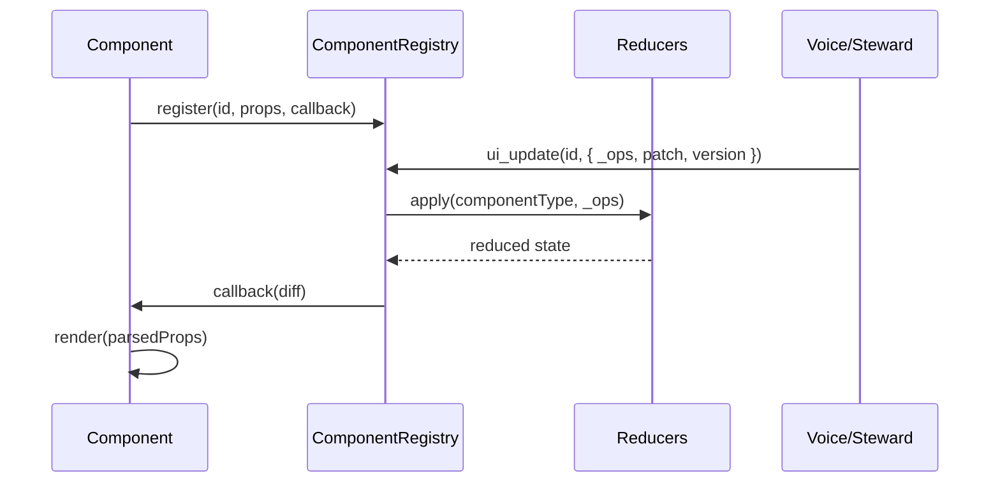

# 🖼️ custom Component System – 2025

This document is the single source of truth for how UI components are rendered, updated and synchronised across users and agents.

*Replaces `ARCHITECTURE_SIMPLIFIED.md` and the component parts of `ARCHITECTURE_SYNC_BUS.md`.*

---

## 1. Core Concepts

| Concept | File | Summary |
|---------|------|---------|
| **ComponentRegistry** | `src/lib/component-registry.ts` | Versioned cache of every live component on the canvas – ID, props, diff history, reducer metadata |
| **Component reducers** | `src/lib/component-reducers/` | Delta handlers (`_ops`) that apply steward/agent operations before props merge |
| **Component CRDT store** | `src/lib/component-crdt.ts` | Deduplicates labeled ops per component and keeps a rolling log for catch-up |
| **ui_update** tool | `src/lib/custom.ts` | AI-facing function for sending deltas/patches to any component |
| **list_components** tool | `src/lib/custom.ts` | Enumerate current IDs/types so AI can target updates |
| **useComponentRegistration** | `src/lib/component-registry.ts` | Hook run by each component to self-register |
| **PropertyDiffViewer** | `src/components/ui/property-diff-viewer.tsx` | Generic UI for showing prop changes |
| **Integration Guide** | `docs/component-steward-guide.md` | Checklist for steward + widget contracts, perf, and testing |

---

## 2. Lifecycle



1. **Register** – on mount, the component calls the hook which stores a `ComponentInfo` entry (props, version, history, callback).
2. **Send delta** – agents send `_ops` + optional patch fields through `ui_update`. Include `version`/`lastUpdated` so the registry can drop stale packets.
3. **Reduce** – registry forwards `_ops` to the component-specific reducer (e.g., debate scorecard ops) before applying any residual patch.
4. **Diff log** – merged props are diffed for auditing and stored along with updated version metadata.
5. **Callback / render** – components receive the fully reduced props via `updateCallback` and re-render.
6. **CRDT log** – `_ops` are recorded via `component-crdt` so late joiners can replay the last ~200 ops deterministically.

---

## 3. Diff Tracking

*Word-level content diff (for documents) lives in `generateWordDiff`.*

For ordinary prop changes we store shallow diffs:

```ts
{
  key: "initialMinutes",
  previous: 5,
  next: 10,
  ts: 1718893562123
}
```

Use `<PropertyDiffViewer>` to render these in any admin/debug panel.

---

## 4. Canvas Events (optional)

Large components (e.g. tldraw, video tiles) still use LiveKit bus topics for physical **position / size** via `CanvasSyncAdapter`. Prop updates remain through `ui_update`.

---

## 5. Migration Guide

1. Replace `CanvasSyncAdapter`‐only components with `useComponentRegistration` + `ui_update`.
2. Delete `bus.send('ui_update', …)` patterns.
3. Use `<PropertyDiffViewer>` if you need audit trails.

---

*Last updated 2025-11-04*
