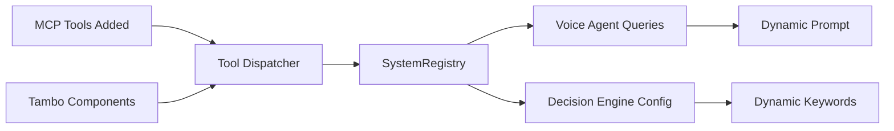

# System Prompts Overview

## Current State of Agent Prompts

### 1. 🎙️ **Voice Agent (Agent #1)** - DYNAMIC ✅

**Location**: `src/lib/livekit-agent-worker.ts` - `buildInstructions()`

**Dynamic Features**:
- ✅ **Tool List**: Dynamically populated from SystemRegistry capabilities
- ✅ **Tool Count**: Shows actual number of available tools
- ✅ **Tool Categories**: Breaks down UI vs MCP tools with counts
- ✅ **Examples**: Includes tool-specific examples when available
- ✅ **Architecture Awareness**: Now knows it's Agent #1 of 3

**System Prompt Structure**:
```
You are Tambo Voice Agent...

ARCHITECTURE AWARENESS:
You are Agent #1 in a 3-agent system:
- YOU (Voice Agent): Handle voice interactions and initiate tool calls
- Decision Engine: Filters your transcriptions for actionable requests
- Tool Dispatcher: Executes tools in the browser and returns results

You have access to [N] tools:
- [Dynamic tool list with descriptions and examples]

Tool Categories:
- UI Generation: X tools
- MCP/External: Y tools  
- Total Available: Z tools
```

**Fallback**: If capabilities aren't loaded, falls back to 7 hardcoded tools.

### 2. 🧠 **Decision Engine (Agent #2)** - PARTIALLY DYNAMIC ⚠️

**Location**: `src/lib/decision-engine.ts` - `buildSystemPrompt()`

**Dynamic Features**:
- ✅ **Available Intents**: Lists intents from SystemRegistry
- ✅ **Trigger Keywords**: Shows first 5 keywords per tool
- ✅ **Architecture Awareness**: Now knows it's Agent #2 of 3
- ⚠️ **Base Prompt**: Still mostly static

**System Prompt Structure**:
```
You are the Decision Engine (Agent #2) in Tambo's 3-agent architecture.

ARCHITECTURE AWARENESS:
- Voice Agent (Agent #1): Captures and transcribes speech, forwards to you
- YOU (Decision Engine #2): Filter transcriptions for actionable requests
- Tool Dispatcher (Agent #3): Executes tools in the browser

[Static context about meeting scenarios...]

AVAILABLE INTENTS:
- youtube_search: youtube, video, search
- generate_ui_component: create, component, timer

TRIGGER KEYWORDS:
- youtube_search: youtube, video, watch, play, show...
- generate_ui_component: create, generate, make, build, show...
```

### 3. 🔧 **Tool Dispatcher (Agent #3)** - NO PROMPT ❌

**Location**: `src/components/tool-dispatcher.tsx`

- React component, not an AI agent
- No system prompt needed
- Handles dynamic routing through code
- Syncs tools to SystemRegistry automatically

### 4. 🎨 **Tambo Dashboard Custom Instructions** - MANUAL CONFIGURATION ⚙️

**Location**: Tambo Dashboard - Custom Instructions field

**Purpose**: These instructions are manually configured in the Tambo dashboard to help Tambo's AI understand the sophisticated 3-agent architecture and how to work with it effectively.

**Current Instructions**:
```markdown
## System Architecture

You are part of a sophisticated 3-agent architecture:

1. **Voice Agent** (LiveKit Worker) - Handles voice input/output and initiates tool calls
2. **Decision Engine** - Filters transcriptions for actionable requests  
3. **Tool Dispatcher** (Browser) - Executes tools and manages UI generation

All agents are synchronized through the SystemRegistry, which is the single source of truth for available capabilities.

## Dynamic Tool Discovery

Tools and components are discovered dynamically:
- MCP tools are synced from MCP servers configured at /mcp-config
- Tambo components are registered in src/lib/tambo.ts
- New tools are automatically available to all agents within 30 seconds
- No code changes needed to add new capabilities

## Tool Naming Conventions

Be aware of tool name mappings:
- Agent tool names (e.g., `youtube_search`) may map to different MCP names (e.g., `searchVideos`)
- The SystemRegistry handles these mappings automatically
- When calling tools, use the agent tool name

## Component State Management

- Components on the canvas maintain persistent state via `useTamboComponentState`
- State changes are synchronized across all agents via LiveKit data channels
- Components can be updated with `ui_update` tool (must call `list_components` first)
- The canvas (tldraw) persists component positions and properties

## Voice vs UI Generation

When users speak:
- The Voice Agent transcribes and the Decision Engine filters
- Actionable requests are sent to Tool Dispatcher
- UI components appear on the canvas automatically
- DO NOT describe UI generation in text responses - it happens automatically

## Available Tool Categories

Tools are organized into categories:
- **UI Generation**: Components like timers, charts, weather widgets
- **MCP/External**: YouTube search, web search, database queries
- **System Tools**: list_components, ui_update

## Best Practices

1. **For voice interactions**: Keep responses concise and conversational
2. **For component updates**: Always get the component ID from `list_components` first
3. **For YouTube searches**: The system automatically selects the best video based on user preferences (latest, official, etc.)
4. **For new capabilities**: Check /mcp-config to add new MCP servers

## Real-time Synchronization

All state changes are synchronized in real-time:
- Component creation/updates emit state events
- Tool results are stored as state
- Canvas changes are persisted
- Everything uses versioned state envelopes for conflict resolution

## Error Handling

If a tool fails:
- The error is captured and returned via data channels
- Circuit breakers prevent duplicate tool calls
- The system gracefully falls back to alternative approaches

Remember: You're orchestrating a sophisticated system where voice, UI, and external tools work together seamlessly. Focus on the user's intent and let the architecture handle the complexity.
```

**Important Note**: These instructions should be updated in the Tambo dashboard whenever major architectural changes are made. They help Tambo's AI understand the system it's working within.

## Dynamic Capability Flow



## What Gets Updated Dynamically

### When Adding MCP Tools:
1. **Tool Dispatcher** syncs to SystemRegistry
2. **Voice Agent** sees new tools in next capability refresh (30s)
3. **Decision Engine** gets new keywords/intents if configured
4. **All agents** can use the new tool immediately

### When Adding Tambo Components:
1. **Tambo Registry** syncs to SystemRegistry
2. **Voice Agent** shows in "UI Generation" category
3. **Decision Engine** detects via generic UI keywords
4. **Tool Dispatcher** routes automatically

## Example: Adding a Weather MCP Tool

1. **User** adds weather MCP server at `/mcp-config`

2. **SystemRegistry** gets updated:
   ```javascript
   {
     id: 'mcp_getWeather',
     name: 'getWeather',
     description: 'Get current weather for a location',
     mcpToolName: 'getWeather',
     agentToolName: 'mcp_getWeather'
   }
   ```

3. **Voice Agent** prompt updates (within 30s):
   ```
   You have access to 12 tools:
   ...
   - mcp_getWeather: Get current weather for a location
   
   Tool Categories:
   - UI Generation: 8 tools
   - MCP/External: 4 tools
   - Total Available: 12 tools
   ```

4. **User** says: "What's the weather in San Francisco?"

5. **Decision Engine** processes with existing weather keywords

6. **Tool Dispatcher** routes to MCP tool automatically

## Recommendations for Further Enhancement

### 1. **Make Decision Engine Fully Dynamic**
- Include tool-specific decision rules in prompt
- Add examples from each tool's configuration
- Update confidence thresholds based on tool types

### 2. **Add Capability Descriptions**
- Include richer descriptions of what each tool category does
- Add limitations or requirements for specific tools
- Provide usage hints based on tool complexity

### 3. **Context-Aware Prompts**
- Adjust prompts based on room type (meeting vs solo)
- Include recent tool usage statistics
- Adapt language based on user expertise level

### 4. **Real-time Feedback Loop**
- Track successful tool executions
- Update prompts to emphasize frequently used tools
- De-emphasize or hide rarely used tools

## Testing Dynamic Prompts

### Check Voice Agent Prompt:
```javascript
// In browser console while agent is running
// Voice Agent will log its full instructions on startup
```

### Check Decision Engine Config:
```javascript
// The Decision Engine logs its configuration
// Look for: "Decision Engine initialized with: X intents, Y keywords"
```

### Monitor Capability Updates:
```javascript
// Watch for these logs:
"🔄 [Agent] Refreshing capabilities..."
"✅ [Agent] Received capabilities: N tools"
``` 