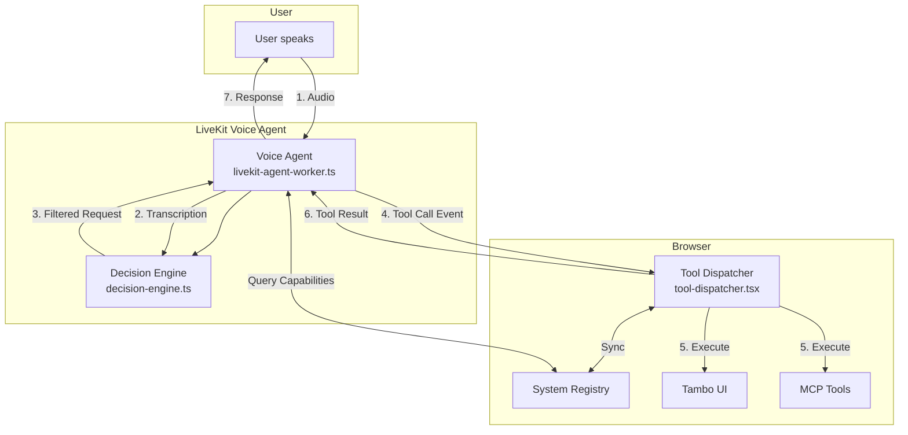

# The Three-Agent Architecture of Tambo

## Overview

Tambo uses a sophisticated **3-agent architecture** where each agent has distinct responsibilities and they work together through well-defined handoffs. This design enables voice-driven UI generation with intelligent decision-making and dynamic tool execution.

## The Three Agents

### 1. 🎙️ **LiveKit Voice Agent** (`livekit-agent-worker.ts`)
**Role**: Voice interface and orchestration  
**Location**: Runs in Node.js as a separate worker process  
**Responsibilities**:
- Captures voice input from users via LiveKit rooms
- Provides real-time transcription using OpenAI Realtime API
- Initiates tool calls based on voice commands
- Manages conversation flow and responds with text
- Queries SystemRegistry for available capabilities on startup
- Refreshes capabilities every 30 seconds

**Key Features**:
- Uses OpenAI Realtime API for natural voice interaction
- Publishes transcriptions to `transcription` topic
- Publishes tool requests to `tool_call` topic  
- Listens for `tool_result` and `tool_error` topics
- Auto-disconnects when no humans remain in room

### 2. 🧠 **Decision Engine** (`decision-engine.ts`)
**Role**: Intelligent filtering and context understanding  
**Location**: Embedded within the LiveKit Voice Agent  
**Responsibilities**:
- Analyzes transcriptions to determine if they contain actionable requests
- Maintains conversation context across multiple speakers
- Detects intent (YouTube search, UI component, general)
- Extracts structured context from natural language
- Summarizes fragmented requests into coherent actions
- Uses GPT-4 to make intelligent decisions about what to forward

**Key Features**:
- 30-second conversation memory window
- Handles collaborative meeting scenarios
- Detects references to previous requests ("do it", "that component")
- Confidence scoring for decisions
- Dynamic configuration from SystemRegistry

### 3. 🔧 **Tool Dispatcher** (`tool-dispatcher.tsx`)
**Role**: Tool execution and UI integration  
**Location**: Runs in the browser as a React component  
**Responsibilities**:
- Receives tool calls from the voice agent
- Routes to appropriate handlers (Tambo, MCP, built-in)
- Manages tool execution state and prevents duplicates
- Publishes results back to the voice agent
- Syncs MCP tools to SystemRegistry
- Integrates with Tambo UI generation system

**Key Features**:
- Circuit breaker for duplicate prevention
- Unified execution through SystemRegistry
- Smart YouTube search with filtering
- Real-time state synchronization
- Capability query endpoint for agents

## Data Flow and Handoffs



## Communication Channels

### LiveKit Data Channels (Topics)
1. **`transcription`** - Live speech-to-text updates
2. **`tool_call`** - Tool execution requests
3. **`tool_result`** - Successful tool execution results
4. **`tool_error`** - Tool execution errors
5. **`capability_query`** - Request for available capabilities
6. **`capability_list`** - Response with system capabilities
7. **`state_change`** - State synchronization (Phase 4)

## Example: Voice to UI Component

Here's how a typical request flows through the system:

1. **User says**: "Create a timer for 5 minutes"

2. **Voice Agent** transcribes: 
   ```json
   {
     "type": "live_transcription",
     "text": "Create a timer for 5 minutes",
     "speaker": "user-123",
     "timestamp": 1234567890
   }
   ```

3. **Decision Engine** analyzes:
   - Detects UI component intent
   - Confidence: 95%
   - Summary: "Create a 5-minute timer"
   - Decides to forward

4. **Voice Agent** publishes tool call:
   ```json
   {
     "type": "tool_call",
     "payload": {
       "tool": "generate_ui_component",
       "params": {
         "prompt": "Create a 5-minute timer"
       },
       "context": {
         "source": "voice",
         "intent": "ui_component",
         "confidence": 95
       }
     }
   }
   ```

5. **Tool Dispatcher** executes:
   - Routes to Tambo UI system
   - Generates RetroTimer component
   - Publishes result back

6. **Voice Agent** receives result and can respond

## Dynamic Capability Discovery

All three agents stay synchronized through the **SystemRegistry**:

```typescript
// On startup, Voice Agent queries:
→ capability_query

// Tool Dispatcher responds with:
← capability_list: {
    tools: [
      { name: "generate_ui_component", description: "..." },
      { name: "youtube_search", description: "..." },
      { name: "searchVideos", description: "..." } // MCP tool
    ],
    decisionEngine: {
      intents: { "youtube_search": ["youtube", "video"] },
      keywords: { "ui_component": ["create", "timer"] }
    }
  }

// Decision Engine uses dynamic keywords
// Tool Dispatcher knows all available tools
// Voice Agent configures its function calls
```

## Key Design Principles

1. **Separation of Concerns**
   - Voice handling separate from decision logic
   - Decision logic separate from execution
   - Each agent has a single responsibility

2. **Dynamic Discovery**
   - No hardcoded tool lists
   - Capabilities discovered at runtime
   - New tools automatically available

3. **Resilient Communication**
   - Event-driven architecture
   - No direct RPC calls
   - Graceful handling of failures

4. **Context Preservation**
   - Conversation memory in Decision Engine
   - State synchronization via SystemRegistry
   - Meeting-aware context tracking

## Adding New Capabilities

To add a new tool or component:

1. **For MCP tools**: Configure in `/mcp-config`
2. **For Tambo components**: Add to `tambo.ts`
3. **That's it!** All agents automatically discover and use it

No need to update any agent code - the dynamic discovery handles everything.

## Debugging Tips

1. **Check capability sync**:
   ```javascript
   // In browser console
   window.systemRegistry?.getAllCapabilities()
   ```

2. **Monitor data channels**:
   - Look for `[Agent]`, `[DecisionEngine]`, `[ToolDispatcher]` logs
   - Check LiveKit data channel messages

3. **Verify handoffs**:
   - Transcription → Decision → Tool Call → Result
   - Each step should log its action

## Future Enhancements

- **Phase 4**: Full state synchronization between agents
- **Phase 5**: Unified tool execution with hot-reloading
- **Phase 6**: Multi-agent collaboration patterns 