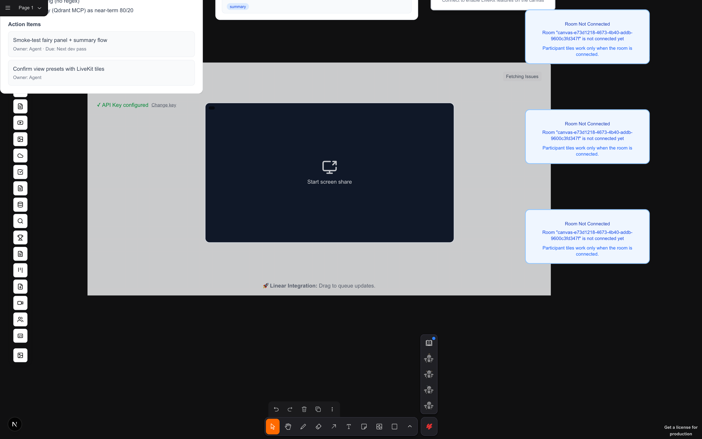
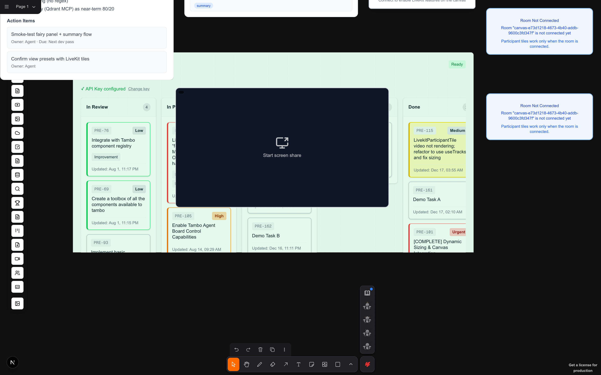
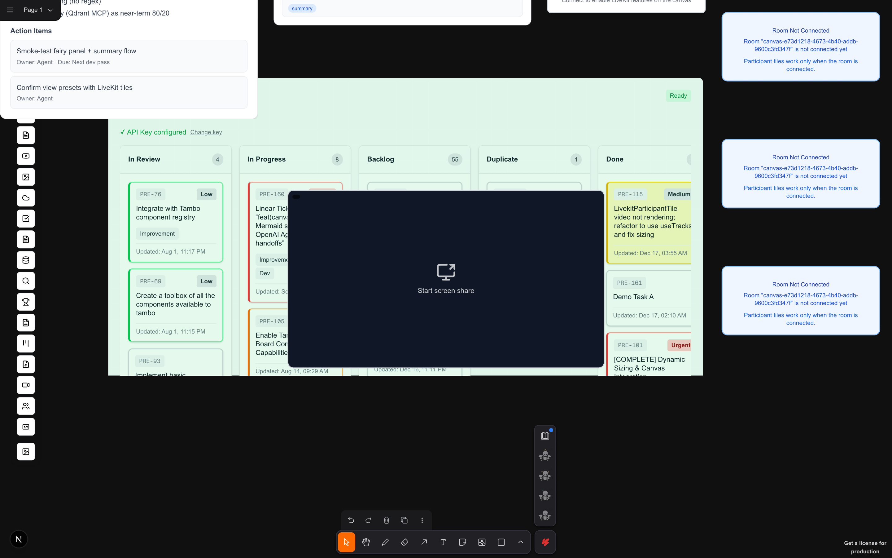
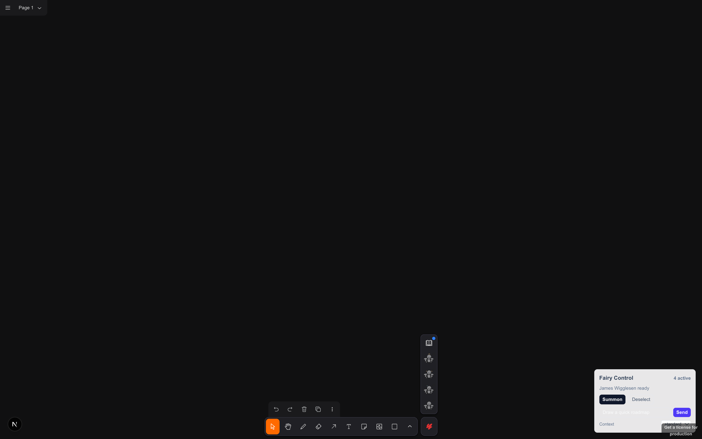
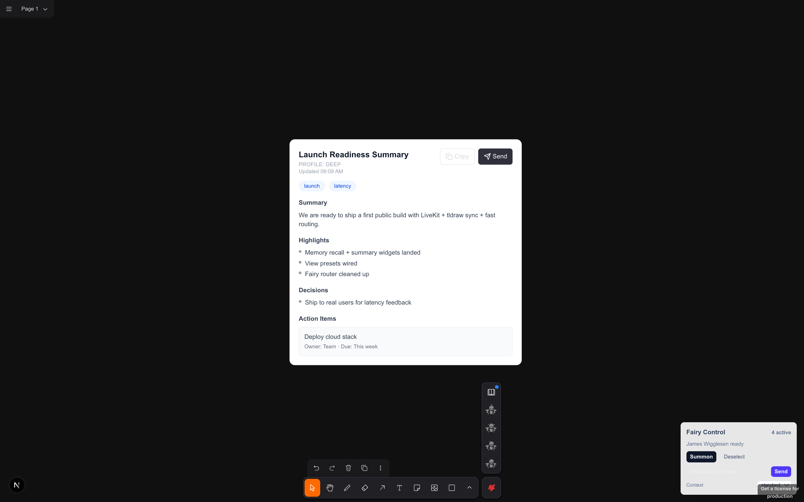
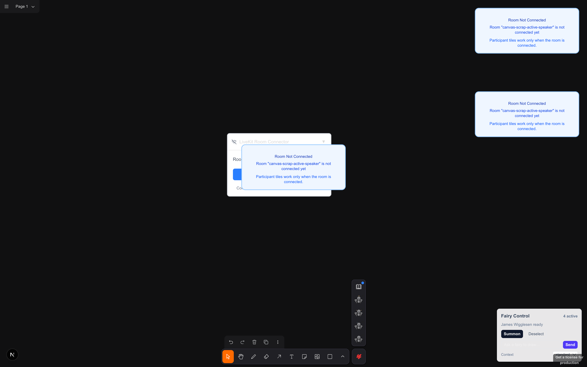

# PRESENT Progress Scrapbook — 2026-01-16

## Milestone 1 — Memory Recall + Meeting Summary Widgets
- Smoke test: dispatch `custom:showComponent` for `MeetingSummaryWidget` + `MemoryRecallWidget`.
- Verified: summary markdown renders; highlights/decisions/action items/tags display; recall hits render.

## Milestone 2 — View Preset (Speaker)
- Smoke test: create LiveKit connector + participant tiles, apply `tldraw:applyViewPreset` with `preset: 'speaker'`.
- Verified: speaker layout applies even when the room is disconnected.

## Milestone 3 — View Preset (Presenter)
- Smoke test: create screen-share tile + participant tiles, apply `tldraw:applyViewPreset` with `preset: 'presenter'`.
- Verified: presenter layout applies with screen-share prominence.

## Milestone 4 — Fairy Panel Error Feedback
- Smoke test: force `/api/steward/runCanvas` to return 500 while sending a prompt.
- Verified: panel surfaces error state and retains prompt content.

## Milestone 5 — Meeting Summary Auto-Send
- Smoke test: create `MeetingSummaryWidget` with `autoSend=true` and stub MCP to resolve.
- Verified: summary renders and shows “Sent to CRM” confirmation.

## Milestone 6 — Active Speaker Reflow
- Smoke test: create LiveKit tiles, apply speaker preset, then dispatch `present:active-speaker-changed`.
- Verified: speaker preset reflows tiles when the active speaker changes.

