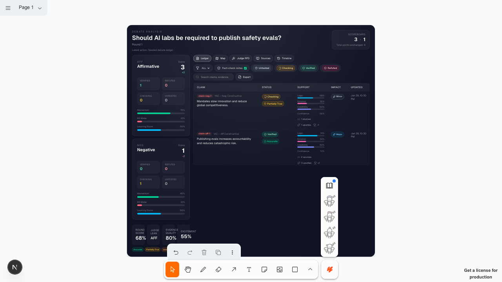
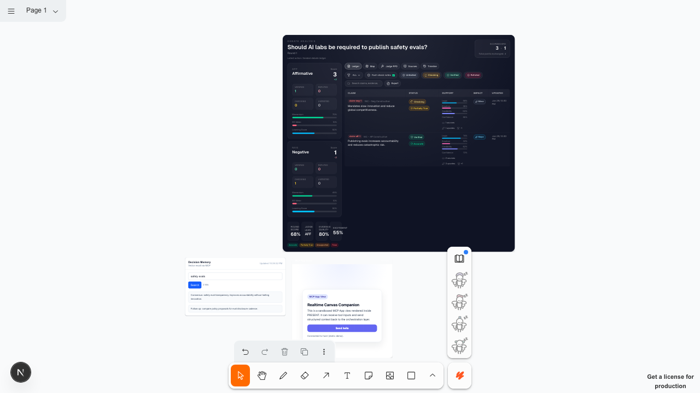
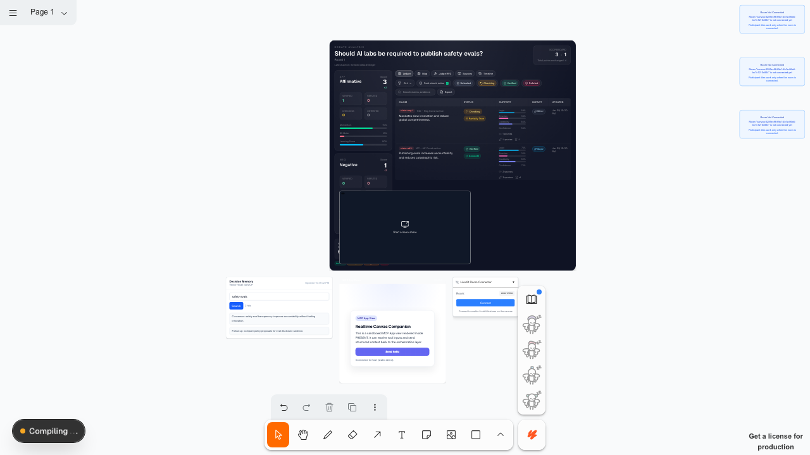

# PRESENT Wow Journey Scrapbook (2026-01-29)

Run ID: 20260129-223917

## Story Arc

Debate -> Verification -> Memory -> Visuals -> Live Layout

This run demonstrates the new paradigms:
- High-density debate scorecard with live metrics
- Memory recall loop (vector intelligence)
- MCP App view rendering inside the canvas
- Fast-lane view presets for instant layout shifts

## Hero Moments

### Debate Scorecard (multi-facet view)

### Scorecard update (claims + metrics)

### MCP App View (tool + UI)

### Presenter View Preset (fast lane)

## Journey Evidence (Screenshots)

| Step | Status | Duration (ms) | Screenshot | Notes |
| --- | --- | --- | --- | --- |
| Sign in / sign up | PASS | 6271 |  |  |
| Canvas loaded | PASS | 5604 | [20260129-223917-00-canvas.png](./assets/2026-01-29/20260129-223917-00-canvas.png) |  |
| Seed debate scorecard | PASS | 1007 | [20260129-223917-01-debate-scorecard.png](./assets/2026-01-29/20260129-223917-01-debate-scorecard.png) | paint 0 ms |
| Update scorecard signals | PASS | 815 | [20260129-223917-02-scorecard-updated.png](./assets/2026-01-29/20260129-223917-02-scorecard-updated.png) | paint 19 ms |
| Create memory recall widget | PASS | 827 | [20260129-223917-03-memory-created.png](./assets/2026-01-29/20260129-223917-03-memory-created.png) | paint 0 ms |
| Populate memory recall results | PASS | 797 | [20260129-223917-04-memory-results.png](./assets/2026-01-29/20260129-223917-04-memory-results.png) | paint 14 ms |
| Render MCP App view | PASS | 935 | [20260129-223917-05-mcp-app.png](./assets/2026-01-29/20260129-223917-05-mcp-app.png) | paint 0 ms |
| Spawn LiveKit tiles | PASS | 3465 | [20260129-223917-06-livekit-tiles.png](./assets/2026-01-29/20260129-223917-06-livekit-tiles.png) |  |
| Apply presenter view preset | PASS | 3197 | [20260129-223917-07-view-preset.png](./assets/2026-01-29/20260129-223917-07-view-preset.png) | applied in 296 ms |

## Speed Benchmarks

| Operation | Duration (ms) | Budget (ms) | Result |
| --- | --- | --- | --- |
| create_component (DebateScorecard) | 0 | 1400 | PASS |
| update_component (DebateScorecard) | 19 | 900 | PASS |
| create_component (MemoryRecallWidget) | 0 | 1200 | PASS |
| update_component (MemoryRecallWidget) | 14 | 900 | PASS |
| create_component (McpAppWidget) | 0 | 1400 | PASS |
| fast-lane view preset (presenter) | 296 | 500 | PASS |

Total journey time: 22918 ms

## Notes
- Debate scorecard seeded via create_component with structured state.
- Memory recall results are injected for deterministic visuals.
- MCP App demo uses a static ui resource (public/mcp-apps/demo.html).
- Presenter preset uses fast-lane tldraw:applyViewPreset.
