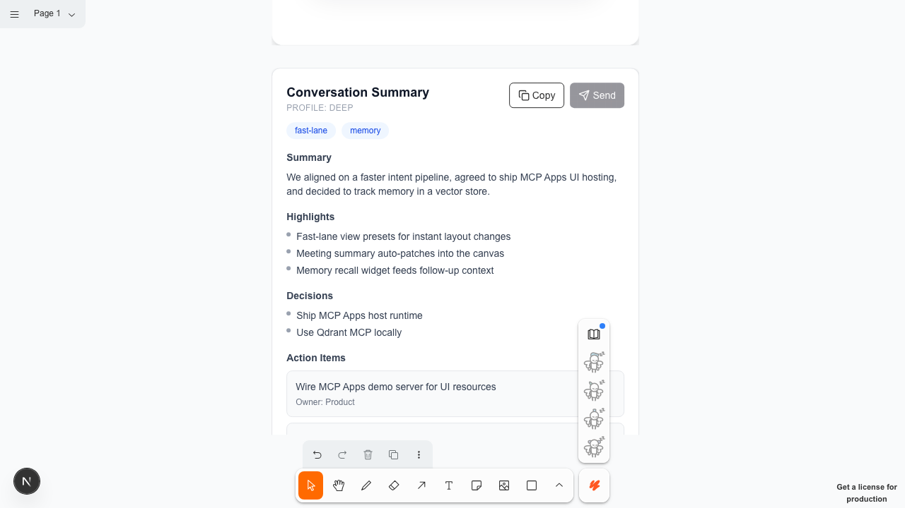
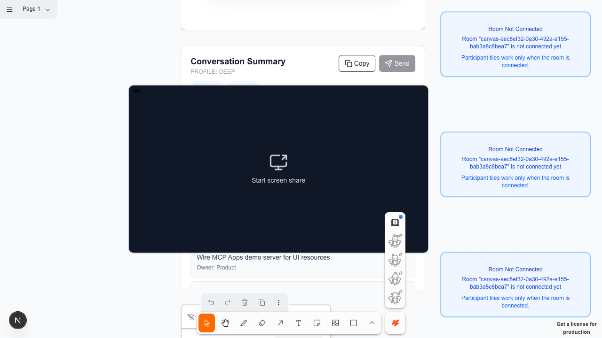

# PRESENT User Story Scrapbook (2026-01-30)

Run ID: 20260130-033959

## Story Arc

Conversation -> Action -> Memory -> Visuals -> View Orchestration

This run demonstrates the new paradigms:
- Fast-lane view presets (instant layout changes)
- Context-spectrum widgets (summary + memory recall)
- MCP App view rendering in-canvas
- Tool-driven UI updates with measured paint latency

## Hero Moments

### Conversation Summary (context spectrum)

### Memory Recall (vector loop)

### MCP App View (tool + UI)

### Presenter View Preset (fast lane)

## Journey Evidence (Screenshots)

| Step | Status | Duration (ms) | Screenshot | Notes |
| --- | --- | --- | --- | --- |
| Sign in / sign up | PASS | 5809 |  |  |
| Canvas loaded | PASS | 5020 | [20260130-033959-00-canvas.png](./assets/2026-01-30/20260130-033959-00-canvas.png) |  |
| Simulate transcript (18 turns) | PASS | 803 |  | 18 turns |
| Open transcript panel | PASS | 1090 | [20260130-033959-01-transcript.png](./assets/2026-01-30/20260130-033959-01-transcript.png) |  |
| Create meeting summary widget | PASS | 783 | [20260130-033959-01-summary-created.png](./assets/2026-01-30/20260130-033959-01-summary-created.png) | paint 1 ms |
| Update summary with decisions + action items | PASS | 667 | [20260130-033959-02-summary-updated.png](./assets/2026-01-30/20260130-033959-02-summary-updated.png) | paint 15 ms |
| Create memory recall widget | PASS | 750 | [20260130-033959-03-memory-created.png](./assets/2026-01-30/20260130-033959-03-memory-created.png) | paint 0 ms |
| Populate memory recall results | PASS | 788 | [20260130-033959-04-memory-results.png](./assets/2026-01-30/20260130-033959-04-memory-results.png) | paint 19 ms |
| Create infographic widget | PASS | 681 | [20260130-033959-05-infographic.png](./assets/2026-01-30/20260130-033959-05-infographic.png) | paint 0 ms |
| Render MCP App view | PASS | 771 | [20260130-033959-06-mcp-app.png](./assets/2026-01-30/20260130-033959-06-mcp-app.png) | paint 0 ms |
| Spawn LiveKit tiles | PASS | 1395 | [20260130-033959-07-livekit-tiles.png](./assets/2026-01-30/20260130-033959-07-livekit-tiles.png) |  |
| Apply presenter view preset (fast lane) | PASS | 459 | [20260130-033959-08-view-preset.png](./assets/2026-01-30/20260130-033959-08-view-preset.png) | applied in 3 ms |

## Speed Benchmarks

| Operation | Duration (ms) | Budget (ms) | Result |
| --- | --- | --- | --- |
| create_component (MeetingSummaryWidget) | 1 | 1200 | PASS |
| update_component (MeetingSummaryWidget) | 15 | 900 | PASS |
| create_component (MemoryRecallWidget) | 0 | 1200 | PASS |
| update_component (MemoryRecallWidget) | 19 | 900 | PASS |
| create_component (InfographicWidget) | 0 | 1400 | PASS |
| create_component (McpAppWidget) | 0 | 1400 | PASS |
| fast-lane view preset (presenter) | 3 | 500 | PASS |

Total journey time: 19016 ms

## Notes
- View preset is applied via tldraw:applyViewPreset (fast lane).
- Memory recall results are injected as a simulated MCP response for deterministic capture.
- MCP App demo uses a static ui resource (public/mcp-apps/demo.html).
- Transcript events are simulated via livekit:transcription-replay for deterministic logging.
