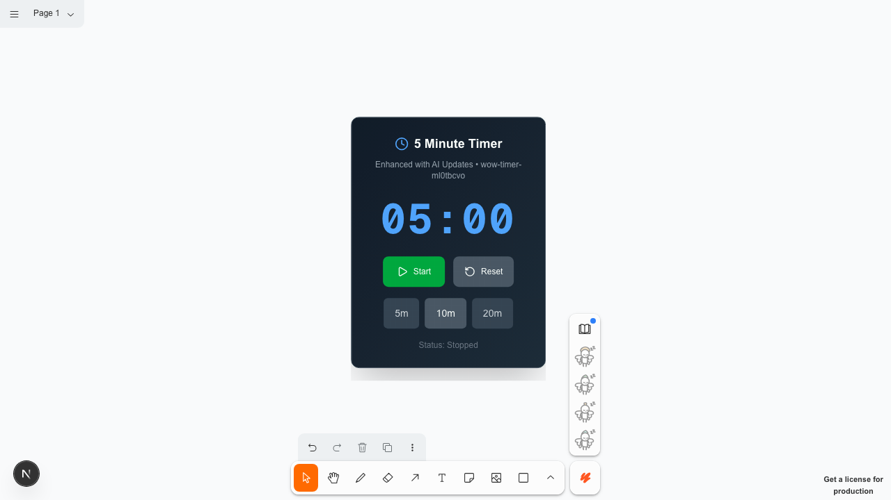
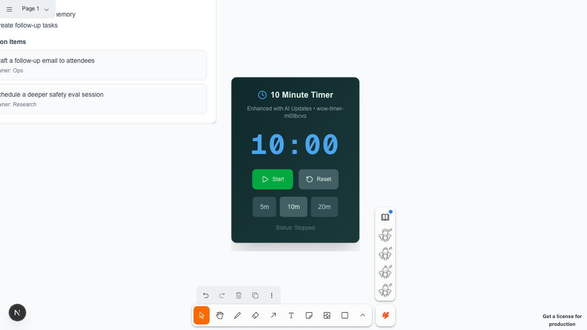
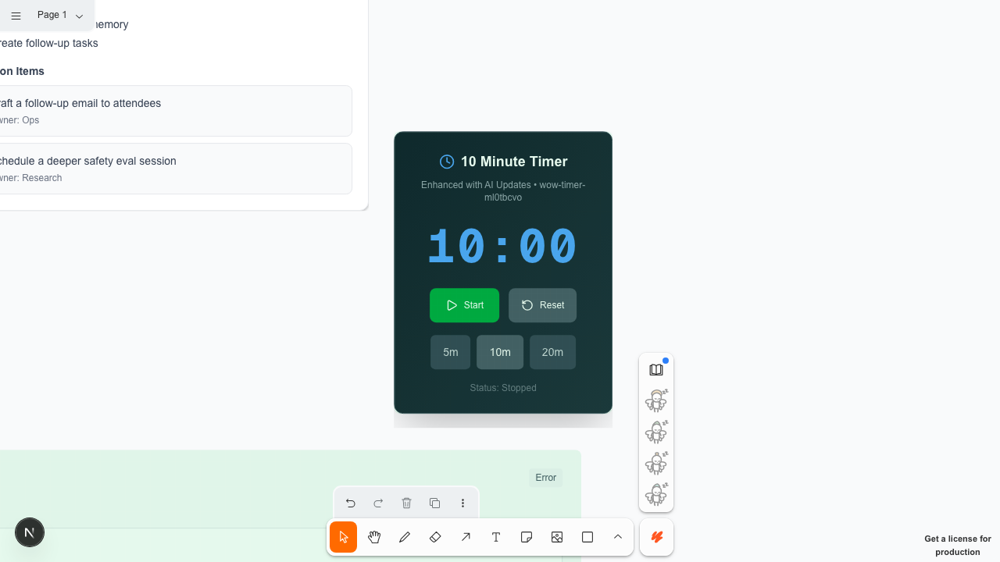
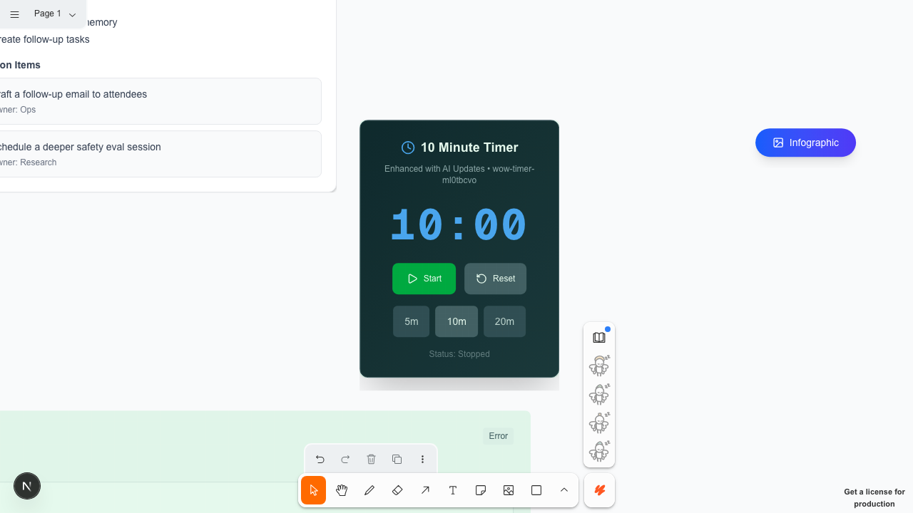

# PRESENT Wow Journey Scrapbook (2026-01-30)

Run ID: 20260130-034108-alt

## Story Arc

Debate -> Verification -> Memory -> Visuals -> Live Layout

This run demonstrates the new paradigms:
- High-density debate scorecard with live metrics
- Memory recall loop (vector intelligence)
- MCP App view rendering inside the canvas
- Fast-lane view presets for instant layout shifts

## Hero Moments

### Focus Timer (live adjustments)

### Meeting Summary (structured outcomes)

### Linear Kanban (follow-up tasks)

### Infographic (visual recap)

### Gallery View (fast lane)

## Journey Evidence (Screenshots)

| Step | Status | Duration (ms) | Screenshot | Notes |
| --- | --- | --- | --- | --- |
| Sign in / sign up | PASS | 4315 |  |  |
| Canvas loaded | PASS | 3626 | [20260130-034108-alt-00-canvas.png](./assets/2026-01-30/20260130-034108-alt-00-canvas.png) |  |
| Simulate transcript (16 turns) | PASS | 805 |  | 16 turns |
| Open transcript panel | PASS | 1070 | [20260130-034108-alt-00-transcript.png](./assets/2026-01-30/20260130-034108-alt-00-transcript.png) |  |
| Create focus timer | PASS | 735 | [20260130-034108-alt-01-timer.png](./assets/2026-01-30/20260130-034108-alt-01-timer.png) | paint 0 ms |
| Update timer to 10 minutes | PASS | 708 | [20260130-034108-alt-02-timer-updated.png](./assets/2026-01-30/20260130-034108-alt-02-timer-updated.png) | paint 5 ms |
| Create meeting summary widget | PASS | 848 | [20260130-034108-alt-03-summary.png](./assets/2026-01-30/20260130-034108-alt-03-summary.png) | paint 0 ms |
| Create Linear Kanban board | PASS | 2121 | [20260130-034108-alt-04-kanban.png](./assets/2026-01-30/20260130-034108-alt-04-kanban.png) | paint 0 ms |
| Create infographic widget | PASS | 730 | [20260130-034108-alt-05-infographic.png](./assets/2026-01-30/20260130-034108-alt-05-infographic.png) | paint 0 ms |
| Apply gallery view preset | PASS | 438 | [20260130-034108-alt-06-gallery.png](./assets/2026-01-30/20260130-034108-alt-06-gallery.png) | applied in 0 ms |

## Speed Benchmarks

| Operation | Duration (ms) | Budget (ms) | Result |
| --- | --- | --- | --- |
| create_component (RetroTimerEnhanced) | 0 | 1400 | PASS |
| update_component (RetroTimerEnhanced) | 5 | 900 | PASS |
| create_component (MeetingSummaryWidget) | 0 | 1500 | PASS |
| create_component (LinearKanbanBoard) | 0 | 1500 | PASS |
| create_component (InfographicWidget) | 0 | 1500 | PASS |
| fast-lane view preset (gallery) | 0 | 500 | PASS |

Total journey time: 15396 ms

## Notes
- Timer updated via update_component to show speed of UI edits.
- Summary widget demonstrates structured notes + action items.
- Kanban board showcases task follow-ups for the session.
- Infographic widget anchors the visual recap.
- Gallery preset uses fast-lane tldraw:applyViewPreset.
