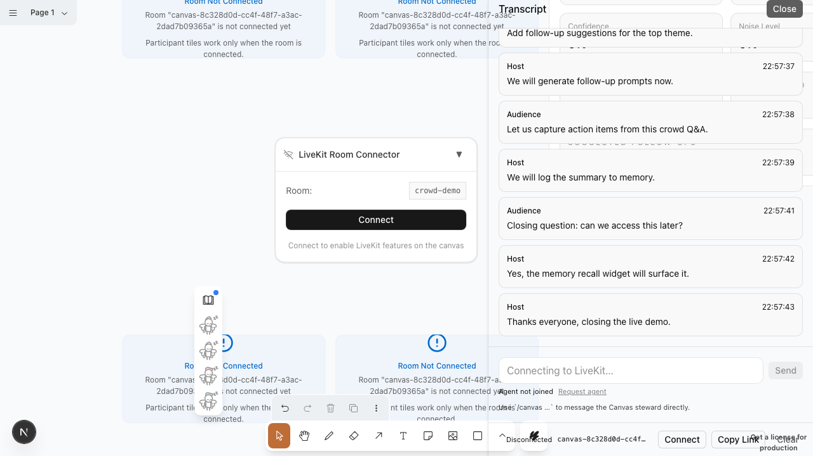
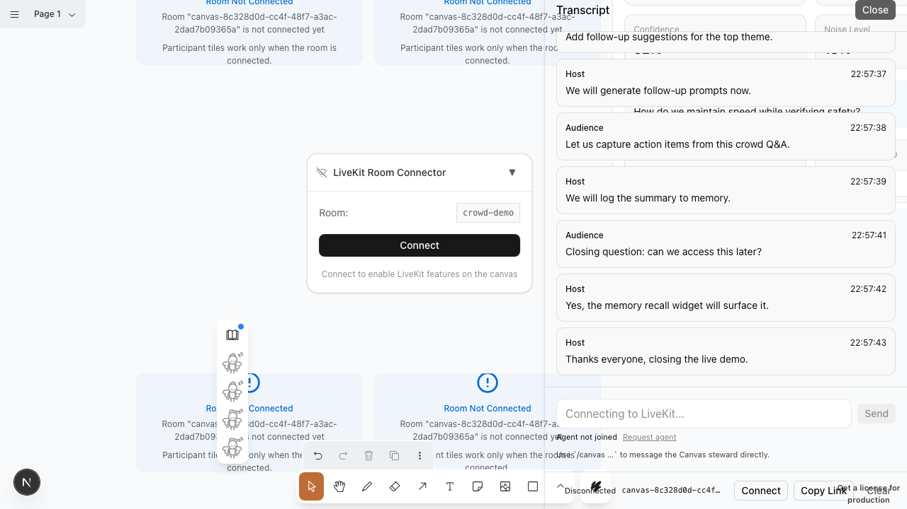
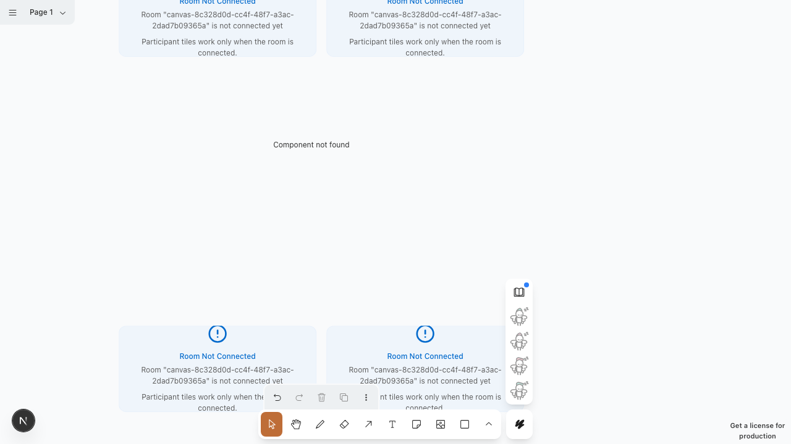

# PRESENT Hand Count Journey (2026-02-09)

Run ID: 20260209-225710-crowd

## Story Arc

Crowd Q&A -> Hand Count -> Question Queue -> Follow-ups -> View Shift

## Hero Moments

### Crowd Pulse Dashboard

### Crowd Pulse Update (hand count + questions)

### Crowd Pulse Follow-ups

### Speaker View Preset

## Journey Evidence (Screenshots)

| Step | Status | Duration (ms) | Screenshot | Notes |
| --- | --- | --- | --- | --- |
| Sign in / sign up | PASS | 5090 |  |  |
| Canvas loaded | PASS | 6691 | [20260209-225710-crowd-00-canvas.png](./assets/2026-02-09/20260209-225710-crowd-00-canvas.png) |  |
| Simulate transcript (19 turns) | PASS | 807 |  | 19 turns |
| Open transcript panel | PASS | 1465 | [20260209-225710-crowd-01-transcript.png](./assets/2026-02-09/20260209-225710-crowd-01-transcript.png) |  |
| Spawn LiveKit tiles (demo) | PASS | 2174 | [20260209-225710-crowd-02-livekit.png](./assets/2026-02-09/20260209-225710-crowd-02-livekit.png) |  |
| Create Crowd Pulse widget | PASS | 1399 | [20260209-225710-crowd-03-crowd-created.png](./assets/2026-02-09/20260209-225710-crowd-03-crowd-created.png) | paint 0 ms |
| Update Crowd Pulse with live signals | PASS | 1237 | [20260209-225710-crowd-04-crowd-signals.png](./assets/2026-02-09/20260209-225710-crowd-04-crowd-signals.png) | paint 22 ms |
| Add follow-up prompts + scores | PASS | 1193 | [20260209-225710-crowd-05-crowd-followups.png](./assets/2026-02-09/20260209-225710-crowd-05-crowd-followups.png) | paint 19 ms |
| Reload + rehydrate Crowd Pulse widget | PASS | 5525 | [20260209-225710-crowd-06-crowd-rehydrated.png](./assets/2026-02-09/20260209-225710-crowd-06-crowd-rehydrated.png) |  |
| Remove Crowd Pulse widget | PASS | 1030 | [20260209-225710-crowd-07-crowd-removed.png](./assets/2026-02-09/20260209-225710-crowd-07-crowd-removed.png) | paint 3 ms |
| Apply speaker view preset | PASS | 977 | [20260209-225710-crowd-06-speaker-view.png](./assets/2026-02-09/20260209-225710-crowd-06-speaker-view.png) | applied in 401 ms |

## Speed Benchmarks

| Operation | Duration (ms) | Budget (ms) | Result |
| --- | --- | --- | --- |
| create_component (CrowdPulseWidget) | 0 | 1300 | PASS |
| update_component (CrowdPulseWidget) | 22 | 900 | PASS |
| update_component (CrowdPulseWidget follow-ups) | 19 | 900 | PASS |
| remove_component (CrowdPulseWidget) | 3 | 900 | PASS |
| fast-lane view preset (speaker) | 401 | 500 | PASS |

Total journey time: 27588 ms

## Notes
- Crowd pulse widget captures hand counts + question queue in real time.
- Question clustering and follow-ups are reflected in the widget.
- Speaker preset is applied via tldraw:applyViewPreset.
- Transcript events are simulated for deterministic story capture.
