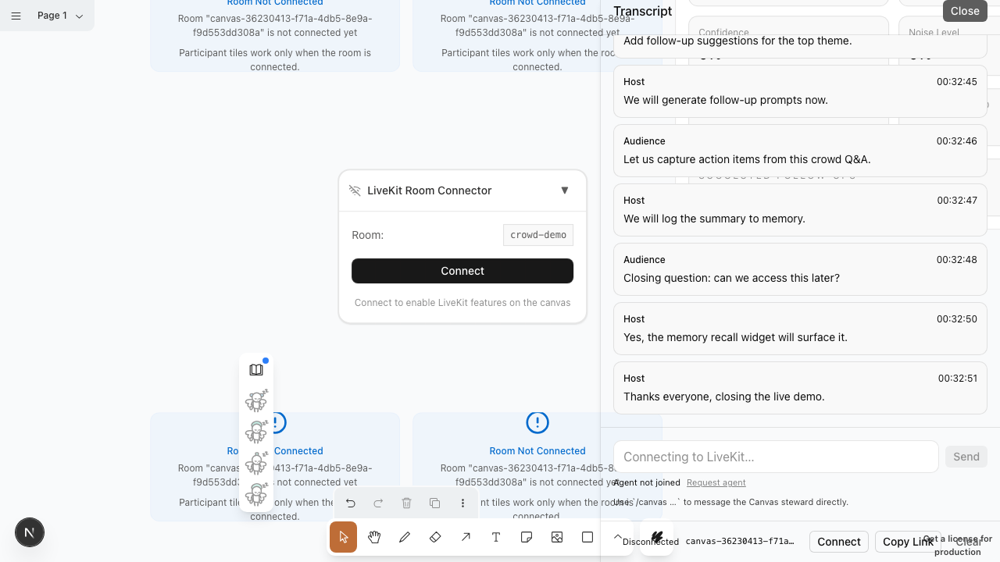
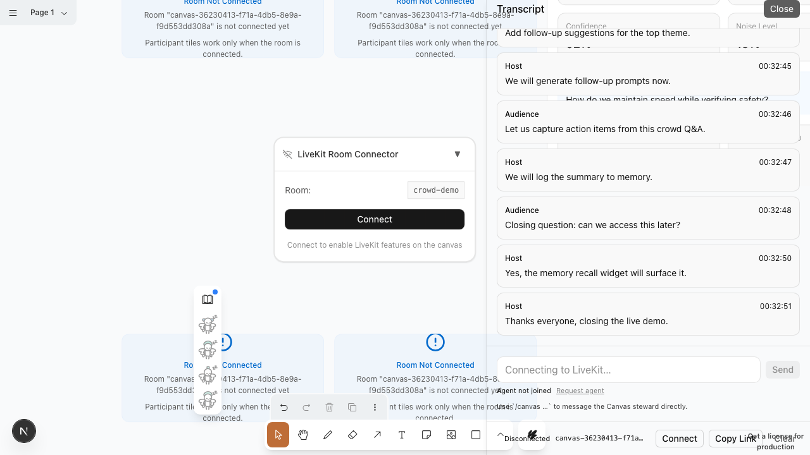
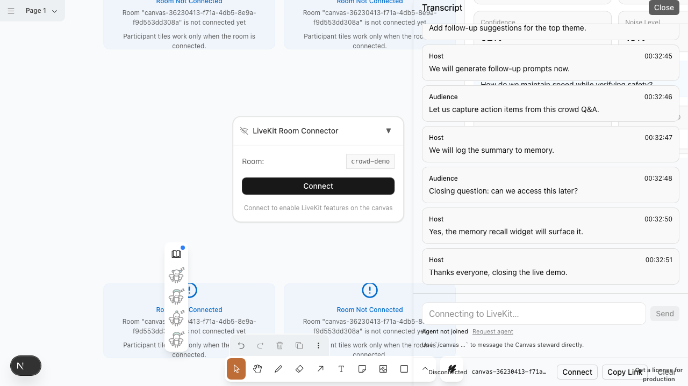

# PRESENT Hand Count Journey (2026-02-11)

Run ID: 20260211-003218-crowd

## Story Arc

Crowd Q&A -> Hand Count -> Question Queue -> Follow-ups -> View Shift

## Hero Moments

### Crowd Pulse Dashboard

### Crowd Pulse Update (hand count + questions)

### Crowd Pulse Follow-ups

### Speaker View Preset

## Journey Evidence (Screenshots)

| Step | Status | Duration (ms) | Screenshot | Notes |
| --- | --- | --- | --- | --- |
| Sign in / sign up | PASS | 6387 |  |  |
| Canvas loaded | PASS | 4931 | [20260211-003218-crowd-00-canvas.png](./assets/2026-02-11/20260211-003218-crowd-00-canvas.png) |  |
| Simulate transcript (19 turns) | PASS | 808 |  | 19 turns |
| Open transcript panel | PASS | 1674 | [20260211-003218-crowd-01-transcript.png](./assets/2026-02-11/20260211-003218-crowd-01-transcript.png) |  |
| Spawn LiveKit tiles (demo) | PASS | 3995 | [20260211-003218-crowd-02-livekit.png](./assets/2026-02-11/20260211-003218-crowd-02-livekit.png) |  |
| Create Crowd Pulse widget | PASS | 1177 | [20260211-003218-crowd-03-crowd-created.png](./assets/2026-02-11/20260211-003218-crowd-03-crowd-created.png) | paint 0 ms |
| Update Crowd Pulse with live signals | PASS | 863 | [20260211-003218-crowd-04-crowd-signals.png](./assets/2026-02-11/20260211-003218-crowd-04-crowd-signals.png) | paint 16 ms |
| Add follow-up prompts + scores | PASS | 1536 | [20260211-003218-crowd-05-crowd-followups.png](./assets/2026-02-11/20260211-003218-crowd-05-crowd-followups.png) | paint 18 ms |
| Reload + rehydrate Crowd Pulse widget | PASS | 7170 | [20260211-003218-crowd-06-crowd-rehydrated.png](./assets/2026-02-11/20260211-003218-crowd-06-crowd-rehydrated.png) |  |
| Remove Crowd Pulse widget | PASS | 2710 | [20260211-003218-crowd-07-crowd-removed.png](./assets/2026-02-11/20260211-003218-crowd-07-crowd-removed.png) | paint 8 ms |
| Recreate Crowd Pulse with same componentId | PASS | 1183 | [20260211-003218-crowd-08-crowd-recreated.png](./assets/2026-02-11/20260211-003218-crowd-08-crowd-recreated.png) | paint 1 ms |
| Apply speaker view preset | PASS | 886 | [20260211-003218-crowd-09-speaker-view.png](./assets/2026-02-11/20260211-003218-crowd-09-speaker-view.png) | applied in 351 ms |

## Speed Benchmarks

| Operation | Duration (ms) | Budget (ms) | Result |
| --- | --- | --- | --- |
| create_component (CrowdPulseWidget) | 0 | 1300 | PASS |
| update_component (CrowdPulseWidget) | 16 | 900 | PASS |
| update_component (CrowdPulseWidget follow-ups) | 18 | 900 | PASS |
| update_component (CrowdPulseWidget post-rehydrate) | 13 | 900 | PASS |
| remove_component (CrowdPulseWidget) | 8 | 900 | PASS |
| create_component (CrowdPulseWidget recreate same id) | 1 | 1300 | PASS |
| fast-lane view preset (speaker) | 351 | 500 | PASS |

Total journey time: 33320 ms

## Notes
- Crowd pulse widget captures hand counts + question queue in real time.
- Question clustering and follow-ups are reflected in the widget.
- Speaker preset is applied via tldraw:applyViewPreset.
- Transcript events are simulated for deterministic story capture.
